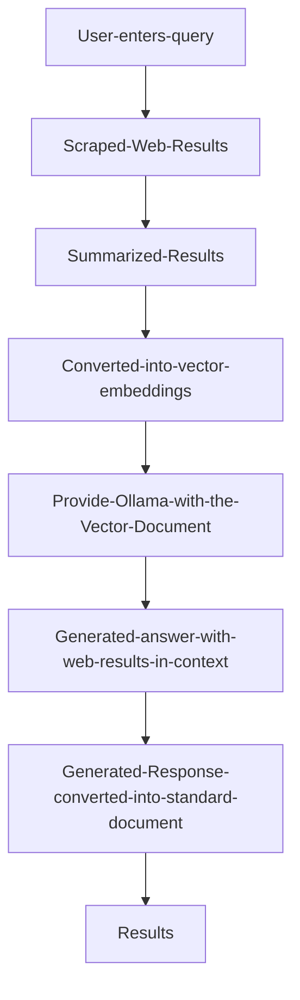

# Perplexa

A smart web-searching AI with Retrieval Augmented Generation (RAG) system that provides AI-powered search capabilities. This project combines web scraping, semantic search, and language model generation to deliver comprehensive answers to user queries.

## Features

- **Web Search Integration**: Scrapes search results from DuckDuckGo to gather relevant information
- **Intelligent Query Processing**: Extracts optimal search keywords from user questions
- **Content Validation**: Evaluates and filters search results for relevance
- **Context-Aware Summarization**: Condenses web content into concise, useful information
- **AI-Powered Responses**: Generates comprehensive, referenced answers using the Qwen2 language model
- **Thai Language Support**: Processes and generates responses in Thai (configurable for other languages)

## Technology Stack

- **Ollama**: Local AI model hosting and inference
- **Qwen2 7B Instruct**: Compact yet powerful language model for generation tasks
- **BeautifulSoup**: HTML parsing for web scraping
- **Requests**: HTTP requests for data retrieval
- **JSON**: Data format for structured information exchange
- **Threading**: Concurrent operations for improved performance

## How It Works

1. **Query Processing**: Analyzes the user question to extract optimal search keywords
2. **Web Scraping**: Fetches relevant search results from DuckDuckGo
3. **Content Validation**: Evaluates the usefulness of each search result
4. **Summarization**: Extracts and condenses relevant information
5. **Response Generation**: Creates a comprehensive, well-structured answer with citations

## Setup and Installation

1. Install dependencies:
   ```bash
   pip install requests bs4 ollama retry
   ```

2. Install Ollama:
   ```bash
   curl -fsSL https://ollama.com/install.sh | sh
   ```

3. Pull the Qwen2 model:
   ```bash
   ollama pull qwen2:7b-instruct-q6_K
   ```

4. Set environment variables:
   ```bash
   export OLLAMA_HOST=0.0.0.0:11434
   export OLLAMA_ORIGINS=*
   ```

5. Start the Ollama server:
   ```bash
   ollama serve
   ```

## Usage

```python
# Import the necessary components
from perplexa import suplexity, display_answer

# Ask a question
question = "What is JavaScript"

# Get a comprehensive answer
response = suplexity(question)
answer = display_answer(response)
print(answer)
```
## Process Overview


## Architecture

This project implements a RAG (Retrieval Augmented Generation) architecture:

1. **Retrieval**: Searches the web for relevant information
2. **Augmentation**: Processes, filters, and contextualizes the retrieved information
3. **Generation**: Uses a language model to create a comprehensive response

## Workflow


## Future Improvements

- Add support for more search engines
- Add caching for frequently asked questions
- Support for multiple languages
- Add a web interface for easier access

## License

[MIT License](LICENSE)
