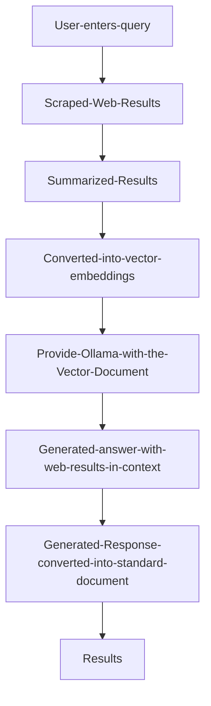

# Perplexa
A smart web-searching AI that transforms your questions into accurate, reliable answers backed by real-time information.

1. Model: qwen2:7b-instruct-q6_K
2. Web-Search Engine: [Duck Duck Go](https://duckduckgo.com/)

## Process Overview

## Workflow

